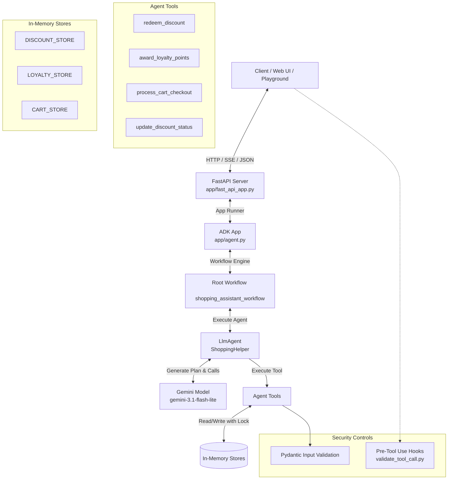

# Shopping Assistant Agent

A production-grade, secure ReAct agent built with the Google **Agent Development Kit (ADK)** and Gemini. The project serves as an intelligent shopping assistant capable of checking out shopping carts, redeeming discount codes, managing loyalty points, and configuring active discount states.

---

## 🏗️ Design Architecture

The agent follows a clean architectural layout leveraging the Google ADK workflow, structured tool definitions, Pydantic data validation, and thread-safe memory stores.

### Architecture Diagram



### Core Architecture Components

1. **API Layer (FastAPI)**: Implemented in [fast_api_app.py](file:///Users/hasmatali/Desktop/5-day-AI-GoogleADK-Kaggle/shopping-assistant/app/fast_api_app.py). It exposes HTTP endpoints, manages server-sent event (SSE) streams for chat interactions, and acts as the entrypoint for local and cloud deployments.
2. **ADK Workflow & Agent**: Defined in [agent.py](file:///Users/hasmatali/Desktop/5-day-AI-GoogleADK-Kaggle/shopping-assistant/app/agent.py). The `shopping_assistant_workflow` connects standard model nodes to the `ShoppingHelper` `LlmAgent`, which makes tool calls based on user intentions.
3. **Pydantic Validation Schemas**: Prior to tool execution, all arguments generated by the model are parsed and strictly validated using Pydantic models (e.g., `RedeemDiscountInput`, `AwardLoyaltyPointsInput`).
4. **Thread-Safe Data Stores**: To ensure consistency across parallel HTTP requests and avoid race conditions (such as double-redeeming a discount code), the in-memory data structures are protected via a threading lock (`store_lock`).
5. **Idempotency Tracking**: A dedicated `PROCESSED_TRANSACTIONS` set tracks transaction IDs to prevent duplicate loyalty points from being awarded for the same transaction.

---

## 🔒 Security & Threat Model

The codebase implements security guidelines outlined in the STRIDE threat model:

* **Authorization Boundaries**: Guest accounts (with IDs starting with `guest_`) are strictly blocked from redeeming discounts and earning loyalty points.
* **Role-Based Privilege Checks**: Only users prefixed with `admin_` can invoke administrative tools like `update_discount_status`.
* **Credential Isolation**: Hardcoded API keys are avoided. Model initialization queries the environment variable context for `GOOGLE_API_KEY` or `GEMINI_API_KEY` first.
* **Pre-Tool Execution Hooks**: A pre-tool hook checks command arguments before executing system functions, blocking risky shell instructions (configured in [hooks.json](file:///Users/hasmatali/Desktop/5-day-AI-GoogleADK-Kaggle/shopping-assistant/.agents/hooks.json) pointing to [validate_tool_call.py](file:///Users/hasmatali/Desktop/5-day-AI-GoogleADK-Kaggle/shopping-assistant/.agents/scripts/validate_tool_call.py)).

---

## 📁 Project Structure

```
shopping-assistant/
├── .agents/                   # Agent configurations, scripts, and skills
│   ├── scripts/               # Pre-tool hooks and execution script helpers
│   └── hooks.json             # Map of matched tools and pre-execution scripts
├── app/                       # Core agent and API code
│   ├── app_utils/             # Custom typing and telemetry helpers
│   ├── agent.py               # Main agent logic, tools, and store definitions
│   └── fast_api_app.py        # FastAPI server entrypoint
├── tests/                     # Test configurations and datasets
│   ├── unit/                  # Unit tests (individual tool validation)
│   ├── integration/           # E2E server and workflow tests
│   └── eval/                  # Quality metrics and agent evaluation datasets
├── pyproject.toml             # Project dependency specification
└── README.md                  # Detailed design and setup documentation
```

---

## 🚀 Setup & Installation

Follow these steps to run the agent locally:

### 1. Prerequisites

Ensure you have the following installed:
* **uv**: Python package and dependency manager - [Install uv](https://docs.astral.sh/uv/getting-started/installation/)
* **Google Cloud SDK**: For logging, tracing, and cloud deployments - [Install GCloud SDK](https://cloud.google.com/sdk/docs/install)
* **agents-cli**: Google Agent CLI tool - Install globally via:
  ```bash
  uv tool install google-agents-cli
  ```

### 2. Install Dependencies

Use `agents-cli` to set up and resolve Python dependencies:

```bash
# Setup CLI skills
uvx google-agents-cli setup

# Run dependency installation
agents-cli install
```

### 3. Configure Credentials

Create a `.env` file in the root of the project or export your Gemini API key in the shell:

```bash
export GEMINI_API_KEY="your-gemini-api-key"
```

---

## 💻 Local Development & Command Reference

| Action | Command | Description |
|---|---|---|
| **Start Playground** | `agents-cli playground` | Launches a local UI to interact with the agent in real time. |
| **Run API Server** | `uv run python app/fast_api_app.py` | Starts the FastAPI app locally at `http://localhost:8000`. |
| **Run Linter** | `agents-cli lint` | Runs checks to verify code formatting and safety rules. |
| **Run Test Suite** | `uv run pytest tests/` | Executes unit, integration, and E2E server tests. |
| **Evaluate Agent** | `agents-cli eval` | Runs performance and quality evaluations on test datasets. |
| **Enhance Infra** | `agents-cli scaffold enhance` | Configures CI/CD pipelines, Terraform, and cloud configs. |

---

## 🧪 Testing & Evaluation

### Running Tests
The project uses `pytest` for testing. Running standard unit and integration tests verifies the correctness of tools, validation schemas, and FastAPI endpoints:

```bash
# Run all unit and integration tests
uv run pytest tests/
```

### Running Agent Evaluations
Use `agents-cli eval` to evaluate the agent's behavior against predefined test cases:

```bash
# Run quality evaluations using the local dataset configuration
agents-cli eval run --config tests/eval/eval_config.yaml
```
The eval runner scores output responses using standard metrics, helping you catch hallucinations or tool call failures early in development.

---

## 📊 Telemetry & Observability

The project has built-in OpenTelemetry instrumentation configured in [telemetry.py](file:///Users/hasmatali/Desktop/5-day-AI-GoogleADK-Kaggle/shopping-assistant/app/app_utils/telemetry.py).

* **Trace Exports**: Exporters route trace spans directly to Google Cloud Trace.
* **GCS Logging Uploads**: Prompt-response logging upload is supported when `LOGS_BUCKET_NAME` is configured.
* **PII Masking / Safety**: To protect user privacy and avoid leaking sensitive data, the telemetry agent operates under the `NO_CONTENT` capture mode (`OTEL_INSTRUMENTATION_GENAI_CAPTURE_MESSAGE_CONTENT="NO_CONTENT"`), ensuring only metadata is logged without raw prompts or model responses.
